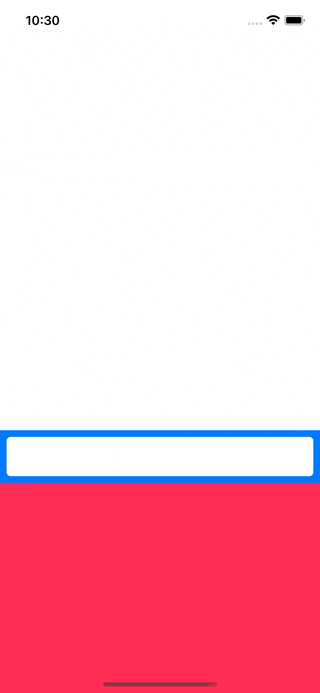

# WWKeyboardShadowView

[](https://developer.apple.com/swift/) [](https://developer.apple.com/swift/)  [](https://developer.apple.com/swift/) [](https://developer.apple.com/swift/)

## [Introduction - 簡介](https://swiftpackageindex.com/William-Weng)
- [A View that can interact with keyboard events can change simultaneously with the height of the keyboard, simply and effectively solving the problem of the input box being blocked during text input.](https://github.com/hackiftekhar/IQKeyboardManager)
- [一個能跟鍵盤事件互動的View，能與鍵盤高度同時做變化，簡單有效處理文字輸入時，輸入框被檔住的問題。](https://medium.com/彼得潘的-swift-ios-app-開發教室/18-ios-鍵盤通知-監聽-d45bd97841a6)



### [Installation with Swift Package Manager](https://medium.com/彼得潘的-swift-ios-app-開發問題解答集/使用-spm-安裝第三方套件-xcode-11-新功能-2c4ffcf85b4b)

```json
dependencies: [
    .package(url: "https://github.com/William-Weng/WWKeyboardShadowView.git", .upToNextMajor(from: "1.1.0"))
]
```

### 可用函式
|函式|說明|
|-|-|
|configure(target:keyboardConstraintHeight:)|設定初始View相關參數|
|register()|註冊鍵盤事件|
|unregister()|解除鍵盤事件|

###
|函式|說明|
|-|-|
|keyboardViewChange(_:status:information:)|鍵盤View的顯示狀態 / 可不可以改變|
|keyboardView(_:error:)|錯誤提示|

### Example
```swift
import UIKit
import WWKeyboardShadowView

final class ViewController: UIViewController {
    
    @IBOutlet weak var keyboardShadowView: WWKeyboardShadowView!
    @IBOutlet weak var shadowViewHeightConstraint: NSLayoutConstraint!
    
    override func viewDidLoad() {
        super.viewDidLoad()
        initSetting()
    }
    
    override func touchesBegan(_ touches: Set<UITouch>, with event: UIEvent?) {
        super.touchesBegan(touches, with: event)
        view.endEditing(true)
    }
}

extension ViewController: WWKeyboardShadowView.Delegate {
    
    func keyboardViewChange(_ view: WWKeyboardShadowView, status: WWKeyboardShadowView.DisplayStatus, information: WWKeyboardShadowView.KeyboardInformation, height: CGFloat) -> Bool {
        return true
    }
    
    func keyboardView(_ view: WWKeyboardShadowView, error: WWKeyboardShadowView.CustomError) {
        print(error)
    }
}

private extension ViewController {
    
    /// 初始化設定
    func initSetting() {
        keyboardShadowView.configure(target: self, keyboardConstraintHeight: shadowViewHeightConstraint)
        keyboardShadowView.register()
    }
}
```
